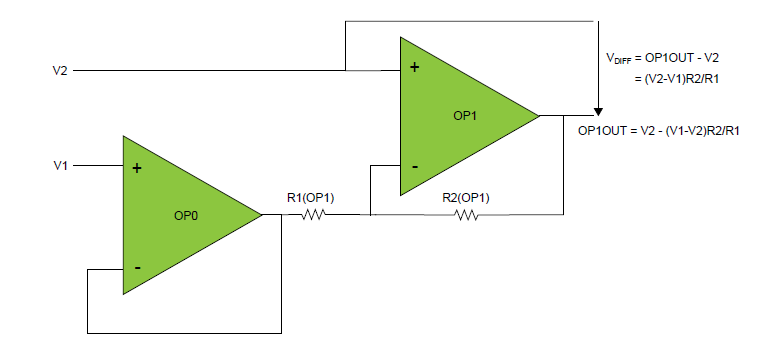

# Getting started with Mindi® simulation and AVR®DB microcontrollers
This guide will get you up and running with simulating the analog OPAMP module in AVR DB family devices using the Mindi simulation tool.
## Configuration: Differential Amplifier
The differential amplifier opamp configuration outputs the amplified difference between two signals. The amplification can be configured by setting the feedback divider.

### Mindi Simulation

Download and open the **Mindi schematic [here](schematics/)**

Press the _play_ button to simulate with an example stimulus source.

### Tweaking

### Updating composer fields
Once the desired result has been verified with Mindi simulation, the corrected values should be moved back into MCC/Start by copying resistor configuration values across to the composer of your preference.

### Don't have Mindi?
Download and install [Mindi simulation tool](https://www.microchip.com/mplab/mplab-mindi)
Download and install Mindi model for AVR DB device